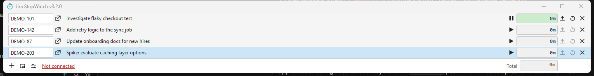
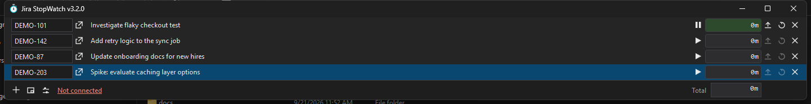
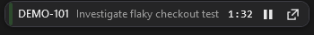

## Summary

[](https://github.com/menegrete/jirastopwatch/actions/workflows/codeql.yml)
[](https://github.com/menegrete/jirastopwatch/actions/workflows/build.yml)

A Windows desktop tool for recording time spent on different Jira tasks.



## Features

- Track time against several Jira issues at once, switch between them with a click or a keyboard shortcut
- Post worklogs straight to Jira, with an optional comment and control over how the remaining estimate is updated
- A floating always-on-top mini timer view, and a taskbar-docked widget, for keeping the active timer visible without the full window
- Light and dark themes
- Optional auto-update, so you're always on the latest release

| Light | Dark |
|---|---|
|  |  |

| Mini timer view |
|---|
|  |

## Getting started

- [Basic setup](docs/basic-setup.md) - connecting to Jira
- [Basic usage](docs/usage.md) - tracking time and posting worklogs
- [Keyboard shortcuts](docs/keyboard-shortcuts.md)
- [Advanced settings](docs/advanced-settings.md)

## Fork history

Jira StopWatch was originally created by Carsten Gehling and later maintained by [Dan Tulloh](https://github.com/tulleuchen) and [Y. Meyer-Norwood](https://github.com/norwd) at [jirastopwatch/jirastopwatch](https://github.com/jirastopwatch/jirastopwatch) - see the [full list of contributors](https://jirastopwatch.com/contributors). This repository forked from that project and is now maintained independently. Since forking, it has diverged substantially:

- Migrated the UI from WinForms to WPF (WinForms is kept only for the tray icon and screen enumeration, which have no WPF equivalent), targeting `.NET 10`
- Added a dark theme alongside the original light theme
- Added a floating, always-on-top mini timer view
- Added a taskbar-docked widget as an alternative minimize destination
- Added optional auto-update
- Fully automated releases, changelog, and versioning via [semantic-release](https://semantic-release.gitbook.io/), driven by [Conventional Commits](https://www.conventionalcommits.org/)
- A number of smaller UX additions: copying an issue's (or its parent's) key, showing parent issue info on subtasks, a configurable max-issues limit, and more

See [CHANGELOG.md](CHANGELOG.md) for the detailed, version-by-version history since the fork.

## Building and releasing

Jira StopWatch targets `net10.0-windows`. Releases are fully automated: every push to `main` that changes `source/StopWatch/**` and passes tests is versioned, changelogged and published as a GitHub Release by CI, with no manual steps. Each release attaches two artifacts:

- a self-contained single-file executable - no separate runtime install needed
- a zip of the framework-dependent single-file build - requires the [.NET 10 Desktop Runtime][dotnet-10-runtime] to already be installed on the machine; if it's missing, Windows shows its own prompt to install it

To reproduce either build locally:

```
dotnet publish source/StopWatch/StopWatch.csproj -c Release -r win-x64 --self-contained true -p:PublishSingleFile=true
dotnet publish source/StopWatch/StopWatch.csproj -c Release -r win-x64 --self-contained false -p:PublishSingleFile=true
```

## Mac OSX and Linux users

Jira StopWatch has historically been compiled and tested to work on Linux Mint with the [Xamarin] packages, back when it targeted WinForms. This hasn't been verified since the move to WPF, and WPF itself doesn't run on Mac or Linux, so it's unlikely to work out of the box today.

## License

Apache License version 2.0 - please read the [license file][LICENSE].

## Feedback

Bug reports, feature requests, and questions are welcome - please use [this repository's Issues][issues].

## Externals

The application depends on [RestSharp] for all communication with Jira.

All icons on buttons were downloaded from [Icons8].

<!-- LINKS -->

[Xamarin]: http://www.mono-project.com/download/#download-lin
[RestSharp]: https://github.com/restsharp/RestSharp
[Icons8]: https://icons8.com
[LICENSE]: LICENSE.md
[dotnet-10-runtime]: https://dotnet.microsoft.com/download/dotnet/10.0
[issues]: https://github.com/menegrete/jirastopwatch/issues
